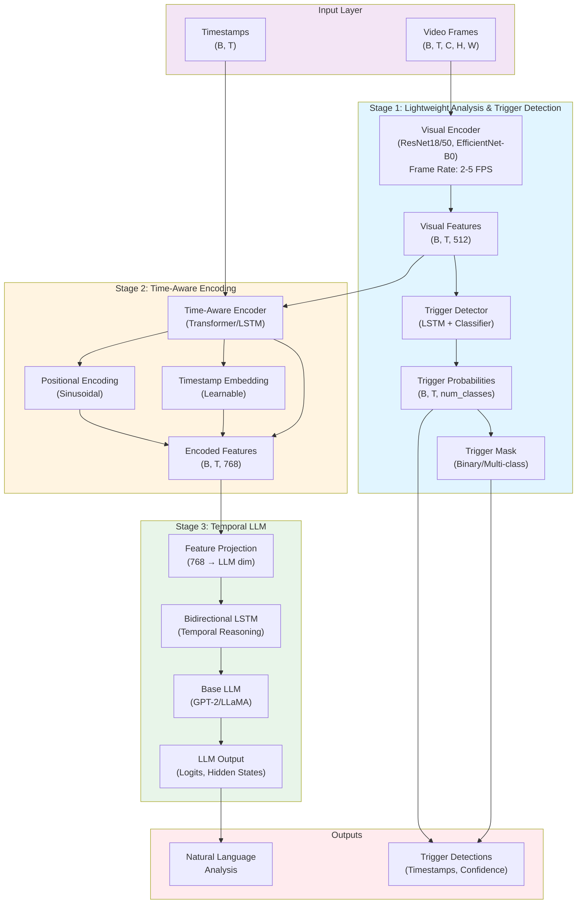

# Video Trigger Model Architecture

This document provides a detailed visual explanation of the Video Trigger Model architecture.

## Architecture Diagram

### Mermaid Diagram (Interactive)



## Detailed Component Breakdown

### Stage 1: Lightweight Video Analysis and Trigger Detection

```
┌─────────────────────────────────────────────────────────────┐
│                    Video Input                               │
│              (B, T, C, H, W) frames                         │
│              Sampled at 2-5 FPS                              │
└────────────────────┬────────────────────────────────────────┘
                     │
                     ▼
┌─────────────────────────────────────────────────────────────┐
│              Visual Encoder                                  │
│  ┌──────────────┐  ┌──────────────┐  ┌──────────────┐      │
│  │  ResNet18   │  │  ResNet50    │  │ EfficientNet │      │
│  │  (Backbone) │  │  (Backbone)  │  │   (Backbone) │      │
│  └──────┬───────┘  └──────┬───────┘  └──────┬───────┘      │
│         │                 │                 │               │
│         └─────────────────┴─────────────────┘               │
│                           │                                 │
│         ┌─────────────────▼─────────────────┐              │
│         │   Feature Projection Head        │              │
│         │   (Backbone → 512 dim)            │              │
│         └─────────────────┬─────────────────┘              │
└───────────────────────────┼───────────────────────────────┘
                            │
                            ▼
              Visual Features (B, T, 512)
                            │
                            ▼
┌─────────────────────────────────────────────────────────────┐
│              Trigger Detector                                │
│  ┌──────────────────────────────────────────────┐          │
│  │  Temporal Context (Optional LSTM)          │          │
│  │  Input: (B, T, 512) → Output: (B, T, 256)   │          │
│  └────────────────────┬─────────────────────────┘          │
│                       │                                     │
│         ┌─────────────▼─────────────┐                      │
│         │  Classification Head      │                      │
│         │  (256 → num_classes)      │                      │
│         └─────────────┬─────────────┘                      │
│                       │                                     │
│         ┌─────────────▼─────────────┐                      │
│         │  Softmax/Sigmoid          │                      │
│         └─────────────┬─────────────┘                      │
└───────────────────────┼─────────────────────────────────────┘
                        │
                        ▼
        Trigger Probabilities (B, T, num_classes)
                        │
                        ▼
            Trigger Mask (Binary/Multi-class)
```

### Stage 2: Time-Aware Feature Encoding

```
┌─────────────────────────────────────────────────────────────┐
│              Time-Aware Encoder                              │
│                                                              │
│  Input: Visual Features (B, T, 512)                       │
│         Timestamps (B, T)                                    │
│                                                              │
│  ┌──────────────────────────────────────────────┐           │
│  │  1. Input Projection                        │           │
│  │     (512 → 768 dim)                         │           │
│  └──────────────────┬───────────────────────────┘           │
│                     │                                        │
│  ┌──────────────────▼───────────────────────────┐           │
│  │  2. Timestamp Integration                    │           │
│  │     ┌────────────────────┐                   │           │
│  │     │ Timestamp Embedding│                   │           │
│  │     │ (Learnable Linear) │                   │           │
│  │     └──────────┬──────────┘                   │           │
│  │                │                              │           │
│  │     ┌──────────▼──────────┐                   │           │
│  │     │ Positional Encoding │                   │           │
│  │     │ (Sinusoidal PE)     │                   │           │
│  │     └──────────┬──────────┘                   │           │
│  │                │                              │           │
│  │     ┌──────────▼──────────┐                   │           │
│  │     │   Add & Normalize    │                   │           │
│  │     └──────────┬───────────┘                   │           │
│  └────────────────┼──────────────────────────────┘           │
│                    │                                           │
│  ┌─────────────────▼─────────────────────────────┐            │
│  │  3. Temporal Encoding                         │            │
│  │     ┌──────────────┐  ┌──────────────┐       │            │
│  │     │ Transformer   │  │    LSTM     │       │            │
│  │     │ (4 layers,    │  │ (Bidirectional)     │            │
│  │     │  8 heads)    │  │             │       │            │
│  │     └──────┬───────┘  └──────┬──────┘       │            │
│  └────────────┼──────────────────┼──────────────┘            │
│               │                  │                             │
└───────────────┼──────────────────┼───────────────────────────┘
                │                  │
                └────────┬─────────┘
                         │
                         ▼
         Encoded Features (B, T, 768)
```

### Stage 3: Temporal LLM

```
┌─────────────────────────────────────────────────────────────┐
│              Temporal LLM                                    │
│                                                              │
│  Input: Encoded Features (B, T, 768)                        │
│                                                              │
│  ┌──────────────────────────────────────────────┐           │
│  │  1. Feature → LLM Projection                 │           │
│  │     (768 → LLM hidden_dim)                   │           │
│  └──────────────────┬───────────────────────────┘           │
│                     │                                        │
│  ┌──────────────────▼───────────────────────────┐           │
│  │  2. Bidirectional LSTM                       │           │
│  │     (Temporal Reasoning)                     │           │
│  │     - Captures long-term dependencies        │           │
│  │     - Bidirectional context                 │           │
│  │     - 2 layers, 512 hidden units            │           │
│  └──────────────────┬───────────────────────────┘           │
│                     │                                        │
│  ┌──────────────────▼───────────────────────────┐           │
│  │  3. Base LLM (GPT-2/LLaMA)                   │           │
│  │     - Pre-trained language model            │           │
│  │     - Processes temporal features           │           │
│  │     - Generates text/logits                 │           │
│  └──────────────────┬───────────────────────────┘           │
│                     │                                        │
│  ┌──────────────────▼───────────────────────────┐           │
│  │  4. Output Projection                        │           │
│  │     (LLM hidden → vocab_size)                │           │
│  └──────────────────┬───────────────────────────┘           │
└─────────────────────┼───────────────────────────────────────┘
                      │
                      ▼
         LLM Output (Logits, Hidden States)
                      │
                      ▼
         Natural Language Analysis
```

## Data Flow Summary

### Training Flow

```
Video Frames (B, T, C, H, W)
    │
    ├─→ Stage 1: Visual Encoder → (B, T, 512)
    │       │
    │       ├─→ Trigger Detector → (B, T, num_classes)
    │       │
    │       └─→ Stage 2: Time-Aware Encoder → (B, T, 768)
    │               │
    │               └─→ Stage 3: Temporal LLM → Text/Logits
    │
    └─→ Loss Computation:
            - Trigger Loss (Cross-Entropy)
            - LLM Loss (Language Generation)
            - Temporal Loss (Smoothness)
```

### Inference Flow (Triggered Analysis)

```
Video Frames
    │
    ├─→ Sample at 3 FPS (lightweight)
    │
    ├─→ Stage 1: Detect Triggers
    │       │
    │       └─→ Filter: confidence > threshold
    │
    └─→ For each trigger:
            │
            ├─→ Extract clip around trigger (±8 frames)
            │
            ├─→ Stage 1: Visual features
            │
            ├─→ Stage 2: Time-aware encoding
            │
            └─→ Stage 3: LLM analysis → Natural language description
```

## Key Features

1. **Efficiency**: Only processes frames at 2-5 FPS for trigger detection
2. **Selective Processing**: Detailed LLM analysis only on triggered frames
3. **Temporal Awareness**: Multiple mechanisms for temporal understanding:
   - Positional encoding
   - Timestamp embeddings
   - Bidirectional LSTM
   - Transformer attention
4. **Modularity**: Each stage can be frozen/updated independently
5. **Flexibility**: Supports different backbones (ResNet, EfficientNet) and LLMs (GPT-2, LLaMA)

## Dimension Flow

```
Input:          (B, T, C, H, W)  e.g., (8, 100, 3, 224, 224)
    ↓
Visual Encoder: (B, T, 512)      e.g., (8, 100, 512)
    ↓
Trigger Detector: (B, T, 2)      e.g., (8, 100, 2)
    ↓
Time-Aware Encoder: (B, T, 768)  e.g., (8, 100, 768)
    ↓
Temporal LLM:   (B, T, vocab)     e.g., (8, 100, 50257)
    ↓
Output:         Text/Logits
```

## Component Details

### Visual Encoder
- **Backbone**: ResNet18/50, EfficientNet-B0
- **Output**: 512-dimensional features per frame
- **Purpose**: Extract visual features efficiently

### Trigger Detector
- **Architecture**: LSTM (optional) + MLP classifier
- **Output**: Trigger probabilities per frame
- **Purpose**: Identify frames requiring detailed analysis

### Time-Aware Encoder
- **Architecture**: Transformer or LSTM
- **Features**: 
  - Positional encoding (sinusoidal)
  - Timestamp embeddings (learnable)
  - Temporal context modeling
- **Output**: 768-dimensional temporally-aware features

### Temporal LLM
- **Base Model**: GPT-2 (or LLaMA, Mistral, etc.)
- **Temporal Module**: Bidirectional LSTM
- **Purpose**: Generate natural language descriptions with temporal understanding

